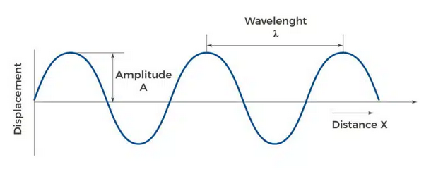
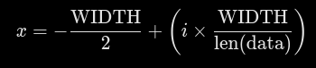
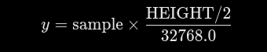

To understand these projects you first need to know what a sound wave is .A sound wave is just a vibration that travels through a medium(air,water etc.) as a wave. The main charactheristics of a sound wave is its frequency, amplitude, wavelength, and speed.

 

Speed is just frequency multiplied by the wavelenght(v=f⋅λ) and frequency is just the number of waves that pass a certain point in one second.
But how do we capture such vibrations? As computers use ones and zeros to compute/do what they do we first need to use a ADC which is an Analog-to-Digital Converter to convert the analog values we get with our microphones to digital values which we can work with pretty easily on python
 An ADC works by measuring the microphone's continuous electrical signal at specific moments and converts it into numbers that Python can easily read and process. Most modern motherboards have ADC's for their 3.5mm jacks but for microphones that have usb output there is no ADC on the motherboard so the microphone has an internal ADC probabily near the usb or the place where the buttons are on your microphone cable. Now that we know how your computer intreprets sound waves. We can finally begin to write the code necessary to visualize sound waves. The testai.py has all the comments needed to understand the code but if you wanted a shorter explanation. As the ADC gets 44.1kHz(44,100 samples from seconds) with stream.read(CHUNK) we take 2205 samples which is 50ms of read time. The 50ms just means that we are locked at a 20FPS execution rate you can mess around with this value to generate different results. And by setting exception on overflow to false we rule out the possibility of getting errors when the sample isn't 50ms(by dropping the older frames). The raw data we get from the microphone is in a messy and unstructured array of binary bytes so first we must map these values to ones we can work with. We use np.frombuffer(raw_str, dtype=np.int16) to turn every 2 bytes(16 bits) into a integer. After implementing this we get a value range of -32,768 to 32,767. The Turtle window(what we use to visualize the audio values)operates on a Cartesian coordinate grid in which the middle is (0,0) and because we need to map this to the desired width and the height of our window(800x400 for our project) we do 2 equations one is 

for the X axis this equation assures that we get the values to map perfectly between -400 and +400 and the other equation is

this equation ensures  that the maximum value we get(+32767) is assigned to half our height which is +200 the same goes for the minimum which gets assigned to -200.

And now we get to the actual rendering.
Since standart Turtle updates the screen frame by frame if we only use t.goto() to write 2205 lines per chunk would create massive latency and just be inefficient.By using the tracer() function which controls the update frequency and setting it to (0,0) which disables automatic screen updates so this way turtle stil does all the calculations of drawing lines and calculating coordinates in RAM off screen. Then we just use the normal functions for drawing in with Turtle and clear the screen before plotting a new segment of audio. After drawing the coordinates do do a manual screen update to show the drawings we did offscreen. By utilizing the screen.trace and using audio samples from 50ms intervals we only need to update 20FPS instead of the 44.1k FPS we would have needed or the 2205 we would have needed with intervals saving massive computational power.